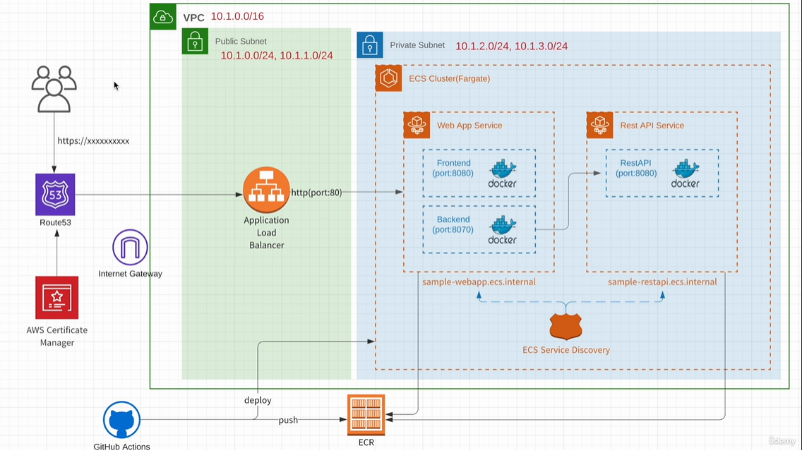

# Amazon ECS × GitHub Actions
Udemy Amazon ECS × GitHub Actionsで始めるコンテナベースのアプリケーション開発
## 全体構成図


## ECS
- ECSの概要
  - クラスタ
    - 複数のサービスを実行できる
  - サービス
    - タスクの起動やロードバランスを担う
    - 同時起動させるタスクの数もここで指定する
    - 機能ごとにサービスを用意する（Webサービス、認証サービス...）
    - 使用するタスク定義を指定する
  - タスク定義
    - タスクの設計書
    - Dockerイメージを1つ以上選択する
  - タスク
    - タスク定義を元に実際に動作しているコンテナ群
- ロードバランサ(ALB)を作成
  - ECSで作成されるターゲットグループを指定する
  - HTTPSリスナーとHTTPリスナーを追加
    - HTTPのルールをHTTPSにリダイレクトされるように設定
    - HTTPSリスナーのルールを編集して、転送先をECSのサービスで作成されたターゲットグループを指定する
  - セキュアリスナーの設定で作成済の証明書を選択
- エンドポイントの作成
  - Private Subnet に作成したECSからAWSリソースにアクセスするために必要
- ECRリポジトリの作成
  - プッシュコマンドの表示からリポジトリにイメージをプッシュするためのコマンドを確認できる
    - ECRに `docker login`
    - `docker build` でイメージ作成
    - `docker tag` でイメージにタグをつける
    - `docker push` でイメージをリポジトリにプッシュする
- ECS の設定
  - ECSクラスタを作成する
  - タスク定義を作成する
    - FARGATEを選択
    - OSを選択、Linux,Windowsが指定できる
    - タスク実行ロールに作成したIAMロールを指定
    - メモリサイズ、CPUサイズを選択
    - コンテナの定義で、ECRのリポジトリ上のイメージを指定する
  - サービスを作成する
    - 作成したタスク定義を選択
    - 同時に起動するタスクの数を指定
    - サブネットを指定
    - ロードバランサを指定
      - ターゲットグループが作成される
    - ECS Service Discoveryの設定
      - Route53にもレコードが作成される

## GitHub Actions
### CI Workflow
```yml
name: CI flow for Amazon ECS

on: [push]

env:
  SLACK_WEBHOOK: https://xxx

jobs:
  ci:
    name: ci
    runs-on: ubuntu-latest
    timeout-minutes: 10

    steps:
    - name: Checkout
      uses: actions/checkout@v2

    - name: Unit Test
      run: cd ${{ github.workspace }}
    - run: cd sample-webapp && npm install && npm run test:unit

    # TODO add tests for backend and rest-api

    - name: Success
      uses: rtCamp/action-slack-notify@v2.0.2
      if: success()
      env:
        SLACK_TITLE: CI flow / Success
        SLACK_COLOR: good
        SLACK_MESSAGE: Message for Success

    - name: Failure
      uses: rtCamp/action-slack-notify@v2.0.2
      if: failure()
      env:
        SLACK_TITLE: CI flow / Failure
        SLACK_COLOR: danger
        SLACK_MESSAGE: Message for Failure

    - name: Cancel
      uses: rtCamp/action-slack-notify@v2.0.2
      if: cancelled()
      env:
        SLACK_TITLE: CI flow / Cancel
        SLACK_COLOR: danger
        SLACK_MESSAGE: Message for Cancel

```

### Deploy Workflow
```yml
name: Deploy work flow for Amazon ECS

on:
  pull_request:
    branches:
      - master
    types: [closed]

env:
  AWS_REGION: ap-northeast-1
  ECS_WEBAPP_SERVICE: tr-ecs-webapp
  ECS_RESTAPI_SERVICE: tr-ecs-restapi
  WEBAPP_CONTAINER_NAME: tr-ecs-webapp
  BACKEND_CONTAINER_NAME: tr-ecs-backend
  RESTAPI_CONTAINER_NAME: tr-ecs-restapi
  WEBAPP_TAG: 1.0.1
  BACKEND_TAG: 1.0.0
  RESTAPI_TAG: 1.0.0
  SLACK_WEBHOOK: https://xxx


jobs:
  deploy:
    name: deploy
    runs-on: ubuntu-latest
    timeout-minutes: 30

    steps:
    - name: Checkout
      uses: actions/checkout@v2

    - name: Configure AWS credentials
      uses: aws-actions/configure-aws-credentials@v1
      with:
        aws-access-key-id: ${{ secrets.AWS_ACCESS_KEY_ID }}
        aws-secret-access-key: ${{ secrets.AWS_SECRET_ACCESS_KEY }}
        aws-region: ${{ env.AWS_REGION }}

    - name: Login to ECR
      id: login-ecr
      uses: aws-actions/amazon-ecr-login@v1

    - name: webapp push to ECR
      id: build-image-webapp
      env:
        ECR_REGISTRY: ${{ steps.login-ecr.outputs.registry }}
      run: |
        cd sample-webapp
        docker build -t $ECR_REGISTRY/$WEBAPP_CONTAINER_NAME:$WEBAPP_TAG .
        docker tag $ECR_REGISTRY/$WEBAPP_CONTAINER_NAME:$WEBAPP_TAG $ECR_REGISTRY/$WEBAPP_CONTAINER_NAME:latest
        docker push $ECR_REGISTRY/$WEBAPP_CONTAINER_NAME:$WEBAPP_TAG
        docker push $ECR_REGISTRY/$WEBAPP_CONTAINER_NAME:latest

    - name: backend push to ECR
      id: build-image-backend
      env:
        ECR_REGISTRY: ${{ steps.login-ecr.outputs.registry }}
      run: |
        cd sample-backend
        docker build -t $ECR_REGISTRY/$BACKEND_CONTAINER_NAME:$BACKEND_TAG .
        docker tag $ECR_REGISTRY/$BACKEND_CONTAINER_NAME:$BACKEND_TAG $ECR_REGISTRY/$BACKEND_CONTAINER_NAME:latest
        docker push $ECR_REGISTRY/$BACKEND_CONTAINER_NAME:$BACKEND_TAG
        docker push $ECR_REGISTRY/$BACKEND_CONTAINER_NAME:latest

    - name: restapi push to ECR
      id: build-image-restapi
      env:
        ECR_REGISTRY: ${{ steps.login-ecr.outputs.registry }}
      run: |
        cd sample-restapi
        docker build -t $ECR_REGISTRY/$RESTAPI_CONTAINER_NAME:$RESTAPI_TAG .
        docker tag $ECR_REGISTRY/$RESTAPI_CONTAINER_NAME:$RESTAPI_TAG $ECR_REGISTRY/$RESTAPI_CONTAINER_NAME:latest
        docker push $ECR_REGISTRY/$RESTAPI_CONTAINER_NAME:$RESTAPI_TAG
        docker push $ECR_REGISTRY/$RESTAPI_CONTAINER_NAME:latest

    - name: Deploy to ECS
      run: |
        aws ecs update-service --service $ECS_WEBAPP_SERVICE --cluster tr-ecs-cluster --force-new-deployment
        aws ecs update-service --service $ECS_RESTAPI_SERVICE --cluster tr-ecs-cluster --force-new-deployment

    - name: Success
      uses: rtCamp/action-slack-notify@v2.0.2
      if: success()
      env:
        SLACK_TITLE: Deploy flow / Success
        SLACK_COLOR: good
        SLACK_MESSAGE: Message for success

    - name: Failure
      uses: rtCamp/action-slack-notify@v2.0.2
      if: failure()
      env:
        SLACK_TITLE: Deploy flow / Failure
        SLACK_COLOR: danger
        SLACK_MESSAGE: Message for failure

    - name: Cancel
      uses: rtCamp/action-slack-notify@v2.0.2
      if: cancelled()
      env:
        SLACK_TITLE: Deploy flow / cancel
        SLACK_COLOR: danger
        SLACK_MESSAGE: Message for Cancel

```
